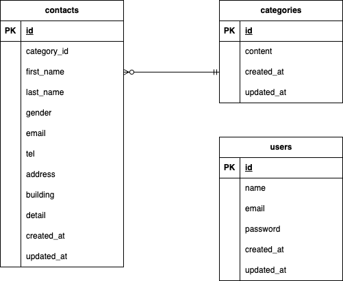

# test_contact-form

## 環境構築
### Dockerビルド
- docker-compose up -d --build

### Laravel環境構築
- docker-composer exec php bash
- php artisan migrate

## 使用技術（実行環境）
- PHP 8.4.12
- Laravel Framework 8.83.29
- Composer version 2.9.2
- nginx 1.21.
- mysql  Ver 8.0.26 for Linux on x86_64

## ER図

## 開発環境# test_contact-form
# test_contact-form
# test_contact-form
